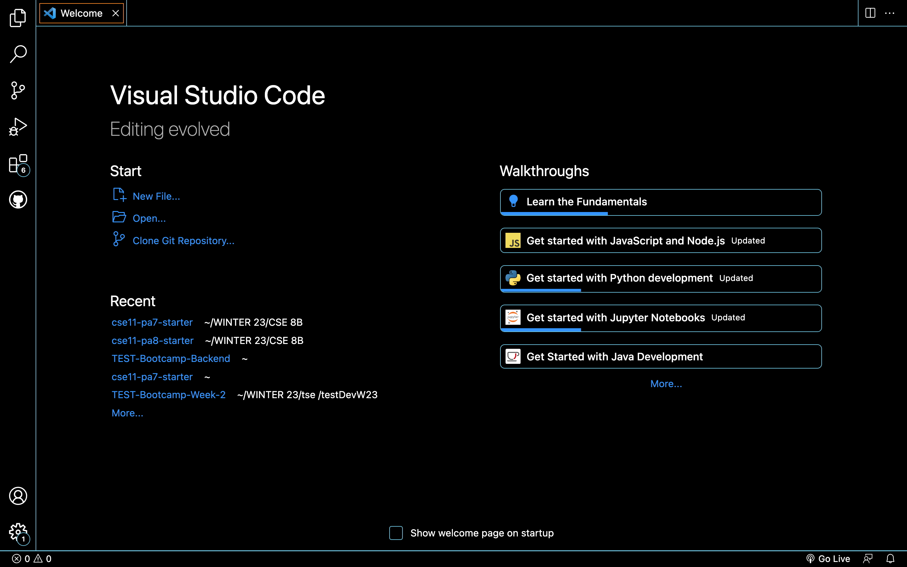
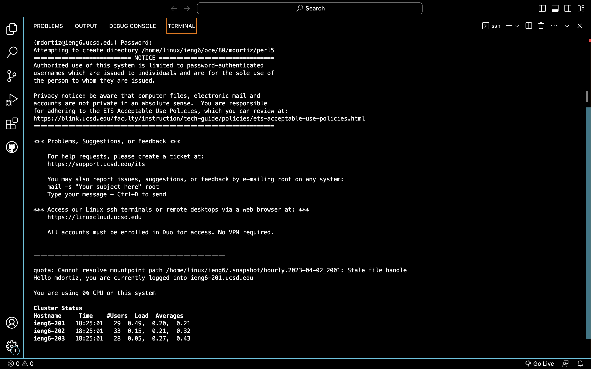
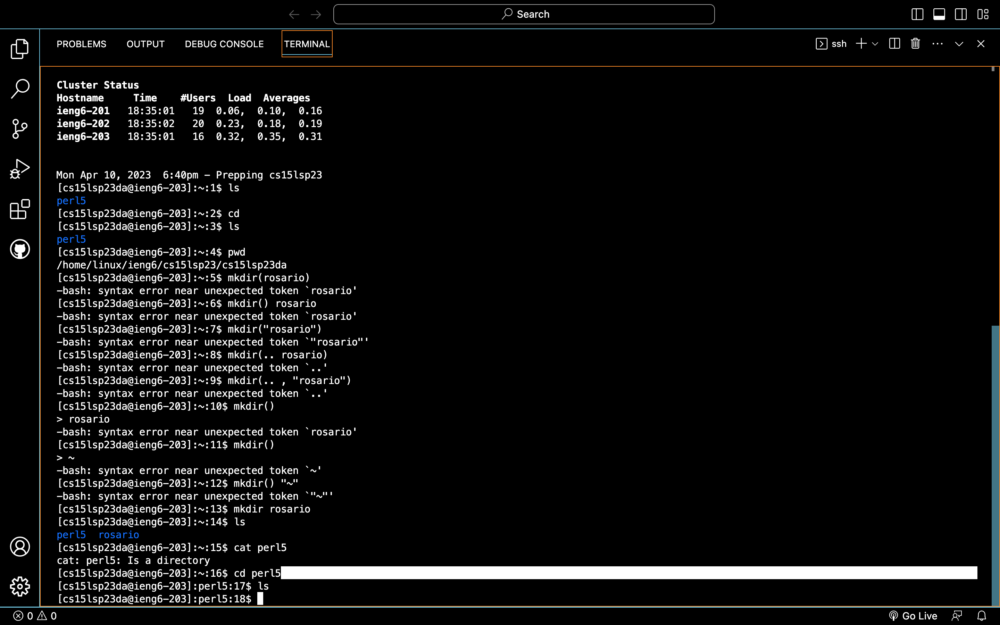

# Lab Report 1 
**by Rosario Ortiz**

 This lab report is a blog post about remote access. More specifically, it is intended to serve as a tutorial for incoming 15L students about logging into a course-specific account on ieng6.

## Steps for logging into a course-specific account on ieng6
1. **Installing VScode**.  

 Normally, to install VScode, you should just go to their [website](https://code.visualstudio.com/) and follow the prompts to download the software. However, I already had VScode downloaded on my laptop, so I didn't do this step during lab. When you open VScode for the first time, you should land on a page similar to the one pictured below.  

. 

2. **Remotely Connecting**. 

  Windows users will need to install Git at this [link](https://gitforwindows.org/) before proceeding. As a Mac user, I skipped this step. 

   With VS Code open, I moved my cursor to the top of the screen to access the menu at the top of the screen. From this menu, I selected Terminal >> New Terminal. This opens a black terminal where users can type the commands needed to connect. The command is "ssh," followed by your username on the remote computer. In this class, this username is "cs15lsp23zz@ieng6.ucsd.edu, " where "zz" is replaced by two letters unique to each student. I found my unique letters by accessing the Password Change Tool linked in the lab Google Document.  

    Written with the example username, the full command is, "ssh cs15lsp23zz@ieng6.ucsd.edu"

   If the username is correct, students will be prompted to enter "yes" or "no." Students should answer "yes" to be prompted for a password, which they reset using the Password Change Tool.   

    A successful connection will produce an output resembling the screenshot below.  
    . 

3. Trying Some Commands. 
  Once you have connected successfully, attempt to use the following commands in terminal:
  - cd 
  - ls
  - pwd
  - mkdir
  - cp

 Note that these commands may have parameters that alter the output they produce. Try typing different words or filepaths after them to see what kinds of parameters they accept and what outputs they produce. This is a screenshot of some commands I tried to run.  

 . 

