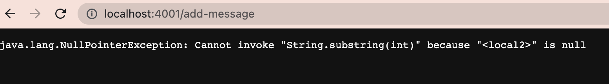
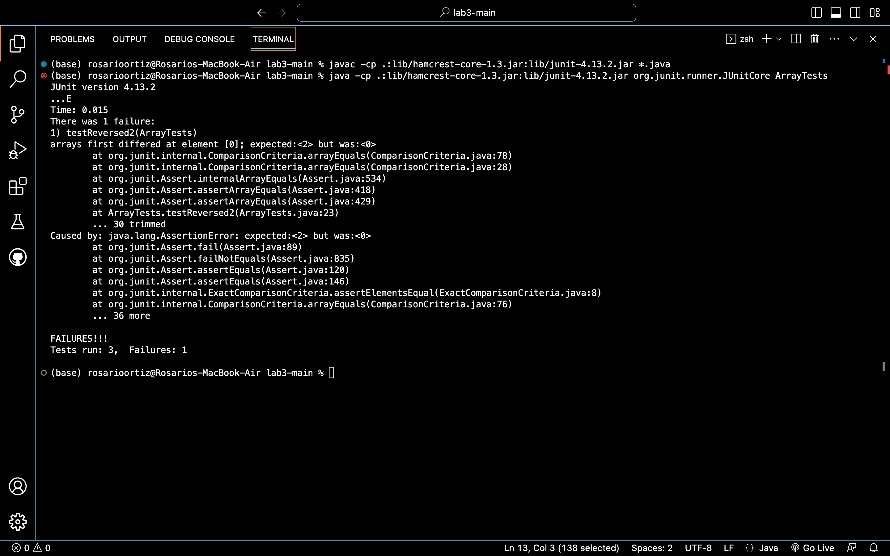

# Lab Report 2 
**by Rosario Ortiz**

## Part 1 - Writing a Web Server 

For this portion of the lab, I used a lot of the code given for writing a server during lab 2. The Server.java file is the same, but I created a new StringServer.java file which adapted code from NumberServer.java. The adapted code is given below:  

```
//most of this code is taken from lab 2's NumberServer. 

import java.io.IOException;
import java.net.URI;

class Handler implements URLHandler {

    public String handleRequest(URI url) {
        if (url.getPath().equals("/add-message")) {
            String q = url.getQuery();
            q = q.substring(2);
        
            return (q) ; 
        }
        else {
            System.out.println("Path: " + url.getPath());
            return "404 Not Found!";
        }
    }
}

class StringServer {
    public static void main(String[] args) throws IOException {
        if(args.length == 0){
            System.out.println("Missing port number! Try any number between 1024 to 49151");
            return;
        }

        int port = Integer.parseInt(args[0]);

        Server.start(port, new Handler());
    }
}

```

<!--- Code-->

**The methods in my code that are called include:**
- the main method
- handleRequest in StringServer.java

**What are the relevant arguments to those methods, and the values of any relevant fields of the class?**

The relevant argument given to the main method is an array containing a single string, which should be parsable as an integer. This integer is saved to the field, "port," which specifies the port number on which to run the server. 

Code executed in the Server.java file provided in lab 2 starts the server at this given port. Code in this file passes requests made to the server into the handleRequest method in StringServer.java, then prints the return value to the webpage. 

The handleRequest method in the Handler class takes the URL entered into the browser as an argument. This URL is shown in the screenshot above. It contains a string , q, which saves the query of this URL.  

**How do the values of any relevant fields of the class change from this specific request? If no values got changed, explain why.**. 

The value of port was assigned to 4001. The value of q was changed by this specific request by assigning the request's query to q. 



**Which methods in your code are called?**

Because main had already been called prior to running this request, the only method that was called again was handleRequest. 

**What are the relevant arguments to those methods, and the values of any relevant fields of the class?**
The argument made to the handleRequest method was the URL for the current request, shown in the screenshot above. 


**How do the values of any relevant fields of the class change from this specific request? If no values got changed, explain why.**
Since main did not run again, the value of port stayed the same (4001). The value of q was changed by this specific request by assigning the request's query to q. In this case, query was null, triggering an error message to print to the browser. 

## Part 2 - Debugging During Lab 3

My lab group found a bug in lab 3 using this JUnit test: 
```
@Test
 public void testReversed2() {
   int[] input1 = {1,2 };
   assertArrayEquals(new int[]{2,1 }, ArrayExamples.reversed(input1));
 }
```
The given JUnit test below did not produce a failure:

```
@Test
  public void testReversed() {
    int[] input1 = { };
    assertArrayEquals(new int[]{ }, ArrayExamples.reversed(input1));
    
  }
```


The symptom, visible in the terminal output of running the these tests, is shown below. 




The bug prior to fixing the code is show below. 
'''

'''

This is the code after fixing the bug.

'''

'''

Briefly describe why the fix addresses the issue.


## Part 3 - New Things I Learned

Something I learned from lab in week 2 that I didn’t know before is that Java can use try{} and catch{}. I have seen these used for asynchronous code in Javascript before, but I'm curious to learn how exactly they work in Java. 


