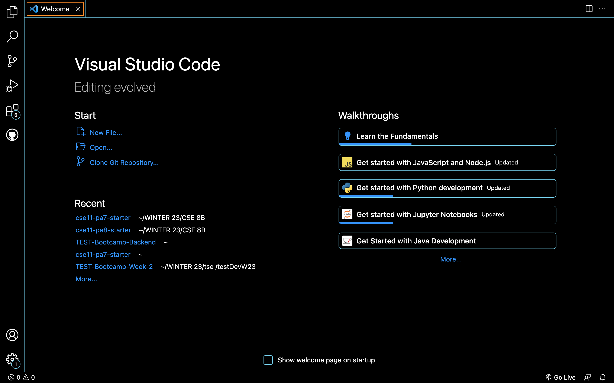

# Lab Report 2 
**by Rosario Ortiz**

 This lab report is a blog post about remote access. More specifically, it is intended to serve as a tutorial for incoming 15L students about logging into a course-specific account on ieng6.

## Steps for logging into a course-specific account on ieng6
1. **Installing VScode**.  

. 

2. **Remotely Connecting**. 

