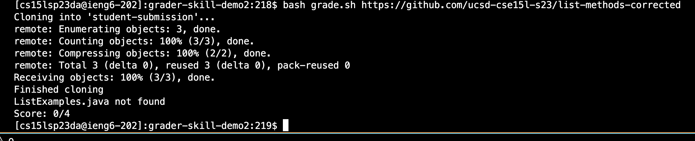

# Lab Report 5
by Rosario Ortiz

## Debugging Scenario

### Post from Student
I am using ssh to edit the buggy files on an ieng6 computer using vim. The symptom of the bug is visible in the terminal screenshot below. Rather than accessing the file, this bash script reports "file not found," regardles of whether the file is in the directory or not. I need it to be able to find the file in nested directories as well.  

example 1
