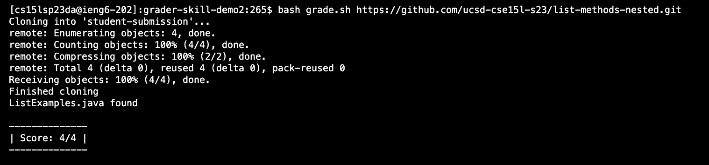

# Lab Report 5
by Rosario Ortiz

## Debugging Scenario

### Post from Student
I am using ssh to edit the buggy files on an ieng6 computer using vim. 

The project directory contains the files GradeServer.java, Server.java , TestListExamples.java, and grade.sh, as well as the directories grading-area,  lib, and student-submission. 

The symptom of the bug is visible in the terminal screenshot below. Rather than accessing the file, this bash script reports "file not found," regardles of whether the file is in the directory or not. I need it to be able to find the file in nested directories as well.  

.  

The screenshot below shows the contents of grade.sh printed to terminal using cat. 


### Response from TA 
Firstly, you should note that in bash, strings can be typed out without any other characters added to them, while variables require "$" to be prepended to them when they are referenced throughout the script. Ensure that your script follows these conventions and then try running again. 

### Student Response
Here is another screenshot showing what terminal output I got from trying that. 

. 


The bug resulted from an error in a conditional statement. Without including "$" prior to the name of the variable storing the path to ListExamples.java, the bash script interpreted the if-statement to be checking for a file with the same name as the variable "NEWPATH". The fix suggested by the TA resolved the bug. 

### Information about setup

The file & directory structure needed can be found in the skill demo 2 github repository. The server files in this repository are not needed to recreate the error. 

The contents of each file before fixing the bug

The contents of grade.sh prior to fixing the bug is in the screenshot provided by the student above. The contents of all other files can match the contents of the original repository. 

The full command line I ran to trigger the bug was 
```
cd grader-skill-demo2
bash grade.sh https://github.com/ucsd-cse15l-s23/list-methods-nested.git
```

To fix the bug, edit grade.sh by changing the if-statement under "echo 'Finished cloning' to the if-statement below:

```
if [[-f $NEWPATH]]
```


## Something I learned 

One thing I learned from my lab experience in the second half of the quarter was the function of "-cp" when compiling a java file. When using it to compile JUNIT tests in CSE 12, we were told not to worry about what it did. Not knowing this from the start of the quarter sometimes made it challenging to troubleshoot issues compiling PAs or using JUNIT. I had a similar issue during lab while compiling a java file because I had forgotten to include this flag and the classpath to JUNIT. Then, Jeannie explained to me that this flag stands for "class path," and it was necessary for java to find the path to JUNIT which it needed to run the JUNIT tests in the java file being compiled. 
